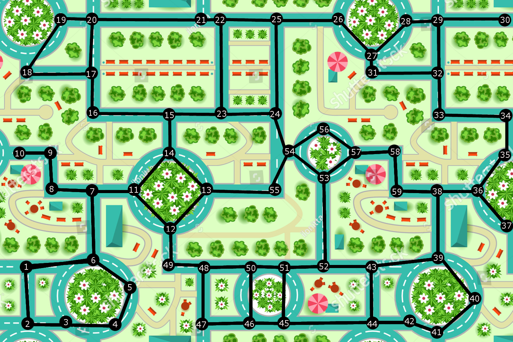
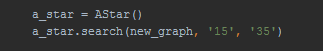

# A* Project

My own custom implementation of A* algorithm from scratch using python.
The algorithm works inside a graph structure consisting of 59 nodes respectively named with their numbers, whose links represent three type of street segments:  
- Standard( Between nodes that are on regular street )
- Transition( If second node is inside roundabout, but not vica verca )
- Roundabout( Between nodes inside a roundabout )

A* uses heuristic function to determine in which direction to proceed in given situation.  

` f(n) = g(n) + h(n) `

Given that n is a node, g(n) - distance from the start node and h(n) is the heuristic function depending on the problem.  

As a heuristic function i use the distance from each node to the center node 55. I found this reasonable since you can choose any node as a starting and end point, preventing any dynamism for heuristics.  

You can set any start aswell as end node in the init script  

  

After the algorithm has done it's job it shows you statistics using pie chart showing in percenteges how many of each segment has been visisted.     

## Prerequisets:

- Python 3.7  
- PyCharm ( Any IDE that supports Python will be sufficient enough, but will require different approach in terms of setup and initializing )  
- matplotlib

## Getting started:
1. Download the archive from this repository.
2. Open PyCharm
3. `File` -> `New Project...`
Put the scripts and tests folder from the archive inside the project folder.
4. `Run` -> `Run...` -> init

Install matplotlib
1. `File` -> `Settings`
2. `Project <name of the project>` -> `Project Interpreter` -> button with `+` sign on it.( add package )  
3.  Type matplotlib and install

## Sources:
Street map image:    
https://www.dreamstime.com/stock-illustration-map-top-view-city-road-trees-pattern-kids-wall-floor-interior-design-image74350164
