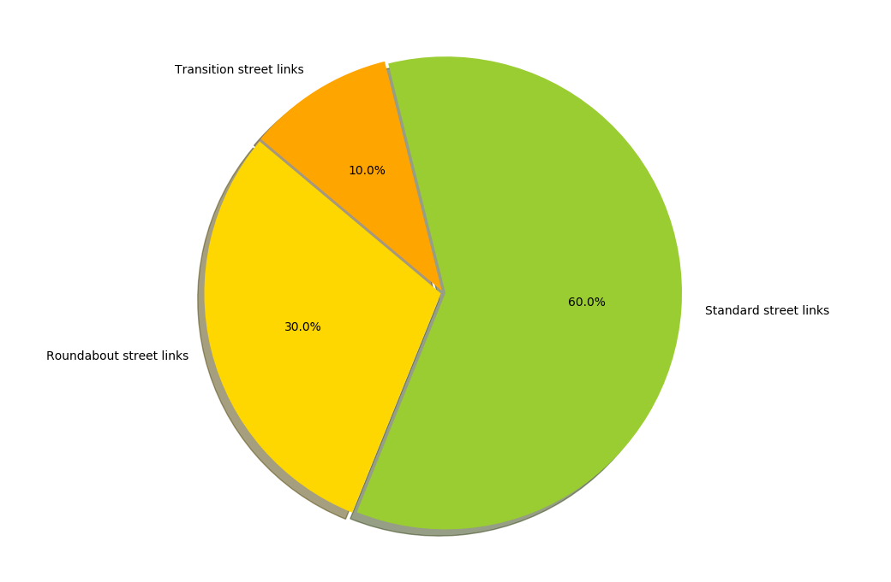

# A* Project

My own custom implementation of A* algorithm from scratch using python.
The algorithm works inside a graph structure consisting of 59 nodes respectively named with their numbers, whose links represent three type of street segments:  
- Standard( Between nodes that are on regular street )
- Transition( If second node is inside roundabout, but not vica versa )
- Roundabout( Between nodes inside a roundabout )

A* uses heuristic function to determine in which direction to proceed in given situation.  

` f(n) = g(n) + h(n) `

Given that n is a node, g(n) - distance from the start node and h(n) is the heuristic function depending on the problem.  

As a heuristic function i use the distance from each node to the center node 55. I found this reasonable since you can choose any node as a starting and end point, preventing any dynamism for heuristics.  

You can set any start aswell as end node in the init script  

  

After the algorithm has done it's job it shows you statistics using pie chart showing in percenteges how many of each segment has been visited.     

## Prerequisets:

- Python 3.7  
- matplotlib

## Getting started:
1. Locate IDLE ( the integrated development environment for Python)
2. `File` -> `Open...` -> select init.py
3. In the new window -> `Run` -> `Run Module`

## Matplotlib:
`python -m pip3 install -U matplotlib`

## Sources:
Street map image:    
https://www.dreamstime.com/stock-illustration-map-top-view-city-road-trees-pattern-kids-wall-floor-interior-design-image74350164
